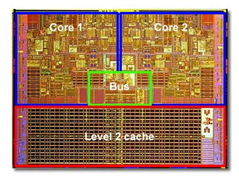

# HOWTO - Python Multiprocessing

By Gabriel Genest

## Table of content

[TOC]


## Introduction

### What is multiprocessing?

Multiprocessing is what we call splitting our work on different cores on our computers. Cores are the basis of the processor. They are independent units that can do basic arithmetic and logical operations. For example, our operating systems natively use multiprocessing to do some work at the same time, like running many applications simultaneously.

### Not to be confused with threading and multithreading

Multiprocessing is similar to multithreading. In fact, when using multiprocessing, the programming language or the OS will use all the possible cores (or as many as we specified) and will also use all the threads associated. For example, a computer with 16 cores will most likely have up to 32 threads. Like I said earlier, cores are independent so they can run at the same time. On the other hand, a core can have a certain number of threads (like 2 in the previous example) and they are not independent. This means that they don't really run simultaneously. The way they work is more pseudo-simultaneous. If two threads have to do a certain job, the operating system will allow the first to run for a short period of time (mostly in micro seconds), they will go to the second one and return back to the first, then the cycle continues until the job is done. This then looks like they both run at the same time while it is not the case. In brief, multithreading is not really faster than normal execution, but allows for doing different tasks in a manner that is not sequential (i.e. not one after the other), while multiprocessing allows for simultaneous execution, hence much faster than normal sequential code.

### Not to be confused with GPU parallelization

Multiprocessing is not the same as parallelizing the code on a GPU. Multiprocessing is *CPU parallelization*, we split the jobs on the cores of the CPU, not the cores of the GPU. Working with the CPU is often (if not, all of the time) easier than working with the GPU, because most common programming languages natively work on the CPU, so in order to work on the GPU we often need to tweak our code and use third party libraries because each company building GPUs has its own architecture and methods to work with graphics cards. The same could be said for the CPU, i.e. Intel, AMD and Apple have different CPU architectures, but programming languages are used to that and do what must be done in order for languages to be able to run on the current CPU. But, if you work with the assembler language, you'll need to know the specifications of the CPU. Even if you work with *C* or *C++* you'll need the right compiler for your OS and CPU architecture. I believe in the near future (maybe 5 to 10 years at maximum), GPU computations will become as easy as CPU computation. It is already far easier than before with NVIDIA's CUDA and other libraries like Open-CL. Some packages already provide an easy interface with CUDA or Open-CL. For example, `cupy` is the GPU version of `numpy`, while `numba` can be used to parallelize code (either CPU or GPU) without too many issues (understanding `numba` is another thing). In brief, GPU parallelization is often MUCH faster than its CPU counterpart, mainly because a GPU has many more cores than the CPU, but GPU computations are better only for certain tasks due to how graphics cards are physically created. In other words, CPU is often better than GPU, because they don't work the same way at the physical and logical level.

## General knowledge about CPU architectures (physical aspects)

Most CPUs are made of cores. Each core has[^1]:

- Data paths (like pipelines and ALUs)
- Control unit which controls data paths
- Memory components (caches and registers)
- Clock to make sure everything runs when it should
- Pad transceiver
- Logic gates to have logical and arithmetic operations

Each component is really important. For example, since most CPUs are synchronous devices, they require a clock to make sure that they run at the right time. This is mainly due to the fact that accessing memory (or receiving/sending instructions) can be complicated and requires a *real* physical current which is not instantaneous. We must wait some time to make sure the data is correct and the addresses or instructions are valid. They then must all be synchronize to take that into account and all components must wait for the slowest one, which can be a drawback.

In terms of memory, caches and registers are really small and are there to make sure that the processor does not need to access the main memory unit of the CPU every time it needs something. For example, if we do $4 + 3 + 2 + 3 + 4$, each integer ($4$, $3$ and $2$) are somewhat stored in memory (the RAM which is global to all cores) and we don't want to waste time by going back and forth between the core and the processor. For a human and a simple instruction, this is not really problematic, but when we have huge instruction blocks with thousands, millions and even billions operations, the time to transfer data becomes really important. This is why we have caches, to keep data close to the core. Caches are small and can't hold a lot of data, but can still play a fundamental role when we use repeating variables or instruction. Caches can be seen as buffers, in the sense that it holds information temporarily. Caches and the main memory unit of the CPU will come in handy when talking about multiprocessing.

<figure>
    
    <figcaption>
        Example of a CPU architecture with 2 cores and shared L2 cache<br>Taken from <a hrlef="url"`>https://www.build-your-own-computer.net/cpu.html</a>
    </figcaption>
</figure>


[^1]: Taken from https://en.wikipedia.org/wiki/Processor_design


## General knowledge about multiprocessing

### Types of multiprocessing

There exists multiple classes of multiprocessing. We won't go into details, after all we are not in a computer sciences courses and I don't know the classes. In terms of memory, there are two classes: shared memory and distributed memory. It is important to know the differences between both, because it can lead to pitfall if we don't. Shared memory is when all cores (or processors) share a large common memory unit. Each processor has its own version of the data. This can lead to problems of memory updates when processors want to update with their own local memory. Distributed memory is when each processor has its own memory unit (not talking about caches here) in which they copy the original data. In modern computers, most CPUs are made of a single chip with multiple processors (multi core processors) and are hence *shared memory* multiprocessors.

Multiprocessing code is complicated. It is difficult to correctly partition the code, it is difficult to coordinate the execution and it is difficult to communicate between cores. There is also cache coherence problems. Shared memory is not problematic when there are no caches involved. The problem arise when caches get data from the main shared memory unit, then the core does some operations and changes the data. The other caches don't have the updated data, since they too got the data from the shared memory unit and did not received any notification about the change done in the first cache. Some more information about ways to prevent incoherent memory can be found [here](https://en.wikipedia.org/wiki/Cache_coherence).

### Terminology often seen

#### Processes

The concept of process is fundamental in multiprocessing (after all, you can't spell multiprocessing without process). It is an instance of a program that is being run by one or many threads. It can be made to execute concurrently (in parallel). An example would be opening the same program many times (for instance Google Chrome) and watching them run independently, or in separate processes. In *Python*, this can be seen as the `Process` class which brings a friendly interface to the abstract concept of *process* (see section [**The `Process` class**](#The  class))

#### Threads

A thread is the smallest sequence that can be managed independently by the scheduler (par of the OS). A thread can be seen as a component of a process. Multiple threads can be part of a single process and share memory, while processes cannot share memory. When multiple threads are working for a single process, it is said that they are working concurrently. It can be dangerous to use multiple threads on the same data, because not everything is thread safe. For example, two threads may attempt to change the data at the same time, which could cause bugs and such specific problems are not easily reproduced and can be really hard to find. This then brings us to some forms of protection: semaphores and locks.

#### Semaphores

A semaphore is and object that controls access to shared resources accessible by multiple processes. It can then help to prevent bugs occurring when two or more processes want to update the data at the same time. On the other hand, using semaphores does not guaranty that there won't be any race conditions (when two processes or more want to access the same data). While they keep record of which process controls what, there can still be some issues. For example, if the process is done playing with data and does not inform the semaphore, the data is still seen as occupied. Another problem arises when processes access data without going through the semaphores. They are not exempt of issues. We can still go around the protection, but it is best to not do it.

#### Locks

A lock is a synchronization primitive that limits the access on resources that are currently in use. They work well when every thread work together to acquire and release locks before accessing data. It has some drawbacks. For example, if a process or thread dies before releasing the lock, it can lead to inaccessible resources since the lock can end up broken. 

## *Python* `multiprocessing`

### Introduction

The `multiprocessing` module is a built-in module already present in *Python*. It has a simple and efficient API and is quite easy to understand as long as what we need is basic. Most of the time, we will only play with pools of workers and (maybe) shared memory. It is used to spawn processes that are spread across a certain number of CPU cores. It works with Unix and Windows.

**Important**: we should always use the syntax `if __name__ == "main"` before calling and creating processes. Otherwise, it can lead to undesired issues. Read [this](https://docs.python.org/3/library/multiprocessing.html#multiprocessing-programming) for more info.

### Processes and pools

#### The `Process` class

It is the basic class to use when we want to create and spawn processes. The syntax is:

````python
multiprocessing.Process(group=None, target=None, name=None, args=(), kwargs={}, daemon=None)
# group should always be None (here for compatibility)
# target: callable to invoke when the Process is started
# name: name of the process. Only for identification, no semantics
# args: arguments to pass to the target
# kwargs: keyword arguments to pass to the target
# daemon: if True, the process will stop when the program finishes. In other words, the Python program stops when all non daemon threads are finished. In some cases, we want the thread to no be terminated until the user says so, hence its value could be False in such cases. By default, inherits the value from the creating process
````

The class has some key methods that should be known to the reader:

- `start()`: starts the process's activity. It can be not called, but can also only be called once.
- `join(timeout=None)`: joins the current process. Can be seen as "wait until this process is done". If not called, will execute the following lines. Timeout is the time maximum to wait. If `None`, will wait indefinitely.
- `is_alive()`: returns whether the process is still alive. A process if alive from when the `start()` method returns until the process is terminated.
- `terminate()`: manual way to terminate the process. Should be avoided when using pips or queues since they can become corrupted.
- `close()`: closes the current instance while releasing all resources. Raises a `ValueError` if the process is still running.

Here is a small example on how to spawn processes:

````python
from multiprocessing import Process
from typing import Union
import time

def show_numbers(numbers):
    for number in numbers:
    	print(f"{number}")
    

if __name__ == "__main__":
    numbers_1 = [2, 4, 6, 8, 10]
    numbers_2 = [1, 3, 5, 7, 9]
    process_1 = Process(target=show_numbers, args=(numbers_1,))
    process_2 = Process(target=show_numbers, args=(numbers_2,))
    process_1.start()
    process_1.join()
    process_2.start()
    process_2.join()
````

The output is:

````python
2
4
6
8
10
1
3
5
7
9
````

But if we join them at the same time...

````python
from multiprocessing import Process
from typing import Union
import time

def show_numbers(numbers):
    for number in numbers:
    	print(f"{number}")
    

if __name__ == "__main__":
    numbers_1 = [2, 4, 6, 8, 10]
    numbers_2 = [1, 3, 5, 7, 9]
    process_1 = Process(target=show_numbers, args=(numbers_1,))
    process_2 = Process(target=show_numbers, args=(numbers_2,))
    process_1.start()
    process_2.start()
    process_1.join()
    process_2.join()
````

We can sometimes see things like:

````python
2
4
6
18
10

3
5
7
9
````

where both processes printed at the same time (it is not 18, is is 1 followed by 8), which means that they are working at the same time, unlike the first example where `process_2` was only started once the first finished.

#### The `Pool` class

It can easily and quickly become tedious to create single process one after the other. This is why is it great to have the `Pool` class to help us. It creates a pool of processes that will carry out tasks provided to the class. What is nice about `Pool` is that we don't have to handle single processes, they are mostly handled by the class. We can use the `with` statement to start processes and the class has some useful and different methods to dispatch workers with functions and arguments. The syntax we often use is:

````python
with multiprocessing.Pool(n_workers) as pool:
	...
````

where we used the `with` statement that will help us a lot because we won't have to deal with joining or closing all the processes. It will be handled automatically. The most important methods are:

- `apply(func, args, kwds)` where we give the function `func` to a **single** worker of the pool. If `args` and `kwds` are also given, `func` receive them when executing. Using `apply` blocks until the result is ready, but can give more versatility to the jobs we want to do. `args` and `kwds` are two optional parameters.
- `apply_async(func, args, kwds, ...)` is similar to `apply`, but is asynchronous. While `apply` blocks until done, `apply_async` also blocks, but will switch to another process after some time, giving the impression they are working at the same time. This version is preferred when dealing with multiprocessing.
- `map(func, iterable, chunksize)` is the parallel equivalent of the built-in `map` function. It takes a function `func` and it applies it over an iterable `iterable`, but the iterable will be splitted and the function will be used by the workers to apply it on their own chunk of the data. We can also specify a chunksize we would like to be used, but it may not be the final one. Also, it is possible to partition the iterable before using `map` which could help us have a better control over how many chunks we have and how many elements there are in them. It is also worth noting that the result is an iterable, and the order in the resulting iterable is the same as the order of the processes started. For instance, the first process started will have its results at the beginning of the final iterable. Finally, it is also important to know that `func` must only take one argument.
- `map_async(func, iterable, chunksize, ...)` is the asynchronous version of `multiprocessing`'s `map`. The arguments are the same and it works essentially the same, except that each process will work asynchronously with its data (i.e. it will allocate some small amounts of time to each job queued on the process).
- `imap(func, iterable, chunksize)` is a "lazier" version of `map`. Compared to `map`, `imap` does not convert the `iterable` argument into a list and the return is a generator (i.e. an iterable that is not "defined") instead of a list.
- `imap_unordered(func, iterable, chunksize)` is an unordered version of `imap`, which means that the order in the resulting generator are arbitrary. As soon as it completes, it returns the generator without being ordered. As soon as a worker finishes, it yield its result.
- `starmap(func, iterable, chunksize)` is the "multi" arguments version of `map`. This means that `iterable` is expected to be an iterable of iterables. Each inner iterable will then be unpacked into `func`, so `func` can now have more than one argument. For example, `[(0, 1), (2, 3)]` will give `[func(0, 1), func(2, 3)]`.
- `starmap_async(func, iterable, chunksize)` is the asynchronous version of `starmap` and the "multi" argument version of `map_async`. There is nothing else to say.

My favourite is `map` because we don't really need to care that much about applying on each process and getting the values ordered in a list. The method does it automatically. If we have **multiple** arguments, we either must proceed carefully (i.e. join them in an iterable that will be passed to the function, hence looks like a single argument) or we use `starmap` which can take multiple argument. The latter is preferable, because we don't need to encapsulate our arguments into another iterable, which adds a useless layer to the arguments.

### Sharing memory

#### Through `Array` and `Value`

`Array` and `RawArray` are two methods used to create what is considered `sharedctypes`, in other words *C* types arrays. The former creates an array that can be locked for synchronization, while the second is considered *raw* because it can't be locked. This is the only difference between the two. We must specify its type and its size.

The same thing can be said about `Value` and `RawValue`. Instead of containing an array, they contain a single value. We must also specify its type. `Value` can be locked, while `RawValue` cannot. We will see some example on how to use them.

#### With `shared_memory`

New to *Python* 3.8 is the `shared_memory` sub module of `multiprocessing`. It provides memory for easy and direct access on each spawned process. We will see some examples on how to use it. We will see that is looks like using `Array` and the other ones, but it is *simpler* and is *prettier*.

### Examples

#### Differences in `Pool` methods

The following examples will show how to use `Pool` and its methods when summing on the elements of an array[^2]. The code for the sum is:

````python
def iterativeSum(iterable):
    res = 0
    for i in iterable:
        res += i
    return res
````

First, we will need to split the (huge) array to sum into sub arrays (kind of divide to conquer approach) with the following method:

````python
def split(container, count):
    container = tuple(container)
    return [container[i::count] for i in range(count)]
````

*Note that the `split` method is not unique. We could come up with other definitions or simply use `numpy.array_split`.

I preferably split everything when I do multiprocessing, because it makes me feel like I control the inputs better. For example, if I want to do a certain thing on multiple images, I will put all the images in a list, then split the list and each process will iterate through its sub list to do the work on its part of the inputs, instead of giving the whole list of images and letting `map` do the splitting!

[^2]: The sequential sum would most likely be faster since it is only a sum, and we could also use `numpy.sum`  or even `sum` and both should be faster than the sequential sum. The goal in these examples is not to have a faster code but to have a feeling of how to use the different methods.

##### Working with `apply ` and `apply_async`

````python
from multiprocessing import cpu_count, Pool

# ...

def apply(iterable, nWorkers):
    # First, split the data into sub arrays (or sub lists).
    # Each process will receive one sub array.
    # It will sum on it.
    splitted = split(iterable, nWorkers)
    with Pool(nWorkers) as pool:
        res = list(pool.apply(iterativeSum, (i,)) for i in splitted)
    # Every method should have the same sum, we will compare
    return sum(res)  

def apply_async(iterable, nWorkers):
    splitted = split(iterable, nWorkers)
    with Pool(nWorkers) as pool:
        res = list(pool.apply_async(iterativeSum, (i,)) for i in splitted)
        # We can add some code here!
        # It should be done *at the same time* as the other processes
        # (depending on the order of the jobs in the CPU
        # and how they are dispatched)
        res = list(r.get() for r in res)
    return sum(res)
````

Here we see they are both very similar. In fact, the code for `Pool.apply` uses `Pool.apply_async`! The difference is that `Pool.apply` blocks the main process until every subprocesses are done, while the asynchronous version only blocks when we use `get` on its results.

##### Working with `map` and `map_async`

````python
# ...

def map_(iterable, nWorkers):
    splitted = split(iterable, nWorkers)
    with Pool(nWorkers) as pool:
        # No need to iterate on the sub lists.
        # Map handles it instead of us.
        res = pool.map(iterativeSum, splitted)
    return sum(res)

def map_async(iterable, nWorkers):
    splitted = split(iterable, nWorkers)
    with Pool(nWorkers) as pool:
        res = pool.map_async(iterativeSum, splitted)
        # We can add code here, async does'nt block
        res = res.get()
    return sum(res)
````

Once again, both methods are really similar, but the asynchronous version doesn't block until we get the results. I personally recommend using `map` in your code, because it is simpler than working with `apply` and the differences in time are not that big of a deal (`map` may even be faster than `apply`, but maybe not than `apply_async`).

##### Working with `imap` and `imap_unordered`

````python
# ...

def imap(iterable, nWorkers):
    splitted = split(iterable, nWorkers)
    with Pool(nWorkers) as pool:
        res = list(pool.imap(iterativeSum, splitted))
        # Watch out! Here, `res` is a generator. This can lead to
        # problems in some codes. This is why we created a list.
    return sum(res)

def imap_unordered(iterable, nWorkers):
    splitted = split(iterable, nWorkers)
    with Pool(nWorkers) as pool:
        res = list(pool.imap_unordered(iterativeSum, splitted))
    return sum(res)
````

We see here that we created lists from the results. This is because `imap` and `imap_unordered` return generators. If you can deal with generators, that's fine, but in our case we preferred working with a `list` in each case.

#### Differences in memory sharing

We will see here how we can use the different methods of memory sharing in some small but interesting cases.

##### Sharing an `Array` object

Let's say we have a list of matrices and they all have the same shape (it can be seen as a tensor). We want to compute the determinant of each *slice* (i.e. of each matrix in the list). One way to do it is sequentially, but for fun let's use some multiprocessing. We will see how we can share the tensor for all the processes used. First, let's generate a tensor of random values. Then, we will need to *give* the tensor to the `Array` object. In fact, since we don't modify the array directly, we will use `RawArray` because we don't need to lock. This is pretty tedious to do, because the number of steps to follow is quite long in my opinion.

````python
import numpy as np
from multiprocessing import Pool, cpu_count, RawArray

__variableDict__ = dict()  # Global dict to keep the shared RawArray


def split(container, count):
    container = tuple(container)
    return [container[i::count] for i in range(count)]


def initWorker(tensor, tensorShape):
    # Function used to initialize each worker with the same 
    # shared array. Putting it in the global dict.
    __variableDict__["tensor"] = tensor
    __variableDict__["tensorShape"] = tensorShape


def dets(slices):
    tensor = __variableDict__["tensor"]
    print(id(tensor))  # The objects should be the same
    
    # First, get the values from the RawArray
    # We can see it as a buffer, an object keeping data
    tensorFromArray = np.frombuffer(tensor).reshape(__variableDict__["tensorShape"])
    determinants = []
    for s in slices:
        determinants.append(np.linalg.det(tensorFromArray[:, :, s]))
    return determinants


class Determinants:

    def __init__(self, tensor):
        self._tensor = tensor
        self._tensorShape = self._tensor.shape
        self._slices = range(self._tensorShape[-1])
        self._nElements = self._tensor.size

    def computeDeterminants(self, nCores):
        tensorArray = RawArray("d", self._nElements)  # Create a RawArray
        tensorFromArray = np.frombuffer(tensorArray).reshape(self._tensorShape)  # Recreate the tensor from the RawArray
        # ^Any changes here will change the RawArray^
        np.copyto(tensorFromArray, self._tensor)  # Copy the values from the tensor to the *buffer*, i.e. the RawArray
        splittedSlices = split(self._slices, nCores)
        
        with Pool(nCores, initializer=initWorker, initargs=(tensorArray, tensor.shape)) as pool:
            tempDeterminants = pool.map(dets, splittedSlices)
            
        determinants = []
        for subList in tempDeterminants:
            determinants.extend(subList)
        return determinants


class DeterminantsNotShared:

    def __init__(self, tensor):
        self._tensor = tensor
        self._tensorShape = self._tensor.shape
        self._slices = range(self._tensorShape[-1])
        self._nElements = self._tensor.size

    def dets(self, slices):
        determinants = []
        print(id(self._tensor))  # The objects should not be the same
        for s in slices:
            determinants.append(np.linalg.det(self._tensor[:, :, s]))
        return determinants

    def computeDeterminants(self, nCores):
        splittedSlices = split(self._slices, nCores)
        with Pool(nCores) as pool:
            tempDeterminants = pool.map(self.dets, splittedSlices)
        determinants = []
        for subList in tempDeterminants:
            determinants.extend(subList)
        return determinants


if __name__ == '__main__':
    nCores = cpu_count()
    tensor = np.random.randint(-5, 5, (5, 5, 12)).astype(float)
    d = Determinants(tensor)
    dets = d.computeDeterminants(nCores)
    print(sum(dets))
    
    d_2 = DeterminantsNotShared(tensor)
    dets = d_2.computeDeterminants(nCores)
    print(sum(dets))
    
    # Sequential, comparing the sum of determinants
    sums = 0
    for i in range(tensor.shape[-1]):
        sums += np.linalg.det(tensor[:, :, i])
    print(sums)
    
````

The output for the `id` looks like (the values will most likely be different each time):

````
2217829570752
2217829570752
2217829570752
2217829570752
2217829570752
2217829570752
2217829570752
2217829570752
2217829570752
2217829570752
2217829570752
2217829570752
````

for the shared `RawArray`. This makes sense since it is shared, hence it is exactly the same object. Changing its value in a certain process would change it also in the other ones. For the not shared version, we have something like (the values will most likely be different each time):

````
2455081188368
2455080799008
2455080796608
2455081223072
2455080799008
2455081188368
2455080796608
2455081223072
2455080799008
2455081188368
2455080796608
2455081223072
````

We can see that some values are repeated. I don't know how to explain it, but it is clear that some copies are made in the process of dispatching the jobs.

Working with `RawArray` is not the best in my opinion. Instead, let's work with the submodule `shared_memory`.

##### Working with `shared_memory`

We will still have to deal with *buffers*, but we won't have to deal with global variables like before. It works with an object called `SharedMemory` that will keep our data and we will be able to reference it with a name.

````python
import numpy as np
from multiprocessing import Pool, cpu_count
from multiprocessing.shared_memory import SharedMemory
from multiprocessing.managers import SharedMemoryManager


def split(container, count):
    container = tuple(container)
    return [container[i::count] for i in range(count)]


class Determinants:

    def __init__(self, tensor):
        self._tensor = tensor
        self._tensorShape = self._tensor.shape
        
        # Will have the name of the SharedMemory space
        self._tensorSharedMemoryName = None
        self._slices = range(self._tensorShape[-1])

    def dets(self, slices):
        tensor = SharedMemory(self._tensorSharedMemoryName)
        print(id(tensor))  # The objects should be the same
        
        # We recreate the array from the buffer with a specific shape
        tensorFromSharedMemory = np.ndarray(self._tensorShape, float, buffer=tensor.buf)
        determinants = []
        for s in slices:
            determinants.append(np.linalg.det(tensorFromSharedMemory[:, :, s]))
        
        # We close the access to the SharedMemory space
        tensor.close()
        return determinants

    def computeDeterminants(self, nCores):
        
        # Will deal with closing and unlinking since we use `with`
        with SharedMemoryManager() as manager:
            sharedMemoryTensor = SharedMemory(create=True, size=self._tensor.nbytes)
            
            # Acess the name
            self._tensorSharedMemoryName = sharedMemoryTensor.name
            tensor = np.ndarray(self._tensorShape, float, buffer=sharedMemoryTensor.buf)
            
            # Like before, copy the values inside the SharedMemory space
            np.copyto(tensor, self._tensor)
            splittedSlices = split(self._slices, nCores)
            with Pool(nCores) as pool:
                tempDeterminants = pool.map(self.dets, splittedSlices)
                determinants = []
                for subList in tempDeterminants:
                    determinants.extend(subList)
        return determinants


if __name__ == '__main__':
    nCores = cpu_count()
    tensor = np.random.randint(-5, 5, (5, 5, 12)).astype(float)
    d = Determinants(tensor)
    dets = d.computeDeterminants(nCores)
    print(sum(dets))
    sums = 0
    for i in range(tensor.shape[-1]):
        sums += np.linalg.det(tensor[:, :, i])
    print(sums)
````

Let's now consider another shared array, the one that is used as the storage of the determinants:

````python
import numpy as np
from multiprocessing import Pool, cpu_count
from multiprocessing.shared_memory import SharedMemory
from multiprocessing.managers import SharedMemoryManager


def split(container, count):
    container = tuple(container)
    return [container[i::count] for i in range(count)]


class Determinants:

    def __init__(self, tensor):
        self._tensor = tensor
        self._tensorShape = self._tensor.shape
        self._tensorSharedMemoryName = None
        self._determinantsName = None
        self._slices = range(self._tensorShape[-1])

    def dets(self, slices):
        tensor = SharedMemory(self._tensorSharedMemoryName)
        determinants = SharedMemory(self._determinantsName)
        print(tensor, determinants)
        tensorFromSharedMemory = np.ndarray(self._tensorShape, float, buffer=tensor.buf)
        determinantsFromSharedMemory = np.ndarray((len(self._slices),), float, buffer=determinants.buf)
        for s in slices:
            determinantsFromSharedMemory[s] = (np.linalg.det(tensorFromSharedMemory[:, :, s]))
        tensor.close()
        determinants.close()

    def computeDeterminants(self, nCores):
        determinantsTemps = np.zeros(len(self._slices), float)
        with SharedMemoryManager() as manager:
            sharedMemoryTensor = SharedMemory(create=True, size=self._tensor.nbytes)
            self._tensorSharedMemoryName = sharedMemoryTensor.name
            tensor = np.ndarray(self._tensorShape, float, buffer=sharedMemoryTensor.buf)
            np.copyto(tensor, self._tensor)

            sharedMemoryDeterminants = SharedMemory(create=True, size=determinantsTemps.nbytes)
            self._determinantsName = sharedMemoryDeterminants.name
            determinants = np.ndarray(determinantsTemps.shape, float, buffer=sharedMemoryDeterminants.buf)
            np.copyto(determinants, determinantsTemps)

            splittedSlices = split(self._slices, nCores)
            with Pool(nCores) as pool:
                 pool.map(self.dets, splittedSlices)
        return determinants.copy()


if __name__ == '__main__':
    nCores = cpu_count()
    tensor = np.random.randint(-5, 5, (5, 5, 12)).astype(float)
    d = Determinants(tensor)
    dets = d.computeDeterminants(nCores)
    print(sum(dets))
    sums = 0
    for i in range(tensor.shape[-1]):
        sums += np.linalg.det(tensor[:, :, i])
    print(sums)

````

And the output of the `tensor` and `determinants` objects is:

````
SharedMemory('wnsm_1a240051', size=4096) SharedMemory('wnsm_6b449165', size=4096)
SharedMemory('wnsm_1a240051', size=4096) SharedMemory('wnsm_6b449165', size=4096)
SharedMemory('wnsm_1a240051', size=4096) SharedMemory('wnsm_6b449165', size=4096)
SharedMemory('wnsm_1a240051', size=4096) SharedMemory('wnsm_6b449165', size=4096)
SharedMemory('wnsm_1a240051', size=4096) SharedMemory('wnsm_6b449165', size=4096)
SharedMemory('wnsm_1a240051', size=4096) SharedMemory('wnsm_6b449165', size=4096)
SharedMemory('wnsm_1a240051', size=4096) SharedMemory('wnsm_6b449165', size=4096)
SharedMemory('wnsm_1a240051', size=4096) SharedMemory('wnsm_6b449165', size=4096)
SharedMemory('wnsm_1a240051', size=4096) SharedMemory('wnsm_6b449165', size=4096)
SharedMemory('wnsm_1a240051', size=4096) SharedMemory('wnsm_6b449165', size=4096)
SharedMemory('wnsm_1a240051', size=4096) SharedMemory('wnsm_6b449165', size=4096)
SharedMemory('wnsm_1a240051', size=4096) SharedMemory('wnsm_6b449165', size=4096)
````

We can see that the `tensor` objects are the same, as well as the `determinants` objects.


## *Python* `numba`

### Introduction

*Numba* is a *Python* module used to help with faster code and parallelization. It can be used to compile code in *no Python* mode, which makes it quite faster than normal and native *Python* code that has to go through the interpreter. It can also be used to parallelize loops or other computations and it supports GPU computations[^3]. It can be seen as a replacement for the `multiprocessing` module when what we have to do is quite simple and don't really require us to manage memory ourselves.

[^3]: Works for CUDA GPU architecture (most recent NVIDIA cards) and (experimentally) with ROC GPU architecture (most recent AMD cards).

### `@jit` and `prange`

`@jit` is probably the most used decorator of *Numba*. It allows to compile just in time (hence *jit*) with or without using the *Python* interpreter. Since it is not the goal of this HOWTO, we won't go into many details about what it means, but we will use it since it allows us to automatically parallelize our code. We will also use the `prange` object, which is similar to the built in `range` object, but is quite different since it can do loops in parallel automatically. Let's take our determinant example and see how we can use *Numba*:

````python
import numpy as np
import numba as nb
import time


@nb.jit(parallel=True, nopython=False)
def determinants(tensor, determinants):
    shape = tensor.shape
    for i in nb.prange(shape[-1]):
        determinants[i] = np.linalg.det(tensor[:, :, i])
    return determinants


if __name__ == '__main__':
    tensor = np.random.randint(-5, 5, (100, 100, 10_000)).astype(float)
    dets = np.zeros((tensor.shape[-1],), float)
    dets_2 = dets.copy()
    determinants(tensor, dets)
    for i in range(tensor.shape[-1]):
        dets_2[i] = np.linalg.det(tensor[:, :, i])
````

We see here that we use the `prange` object and that should automatically parallelize our code. There are some drawbacks to using *Numba*. First of all, I had to put the result array as a parameter instead of declaring it in the function directly. This is because *Numba* uses some of its own definitions of *NumPy* methods which can lead to some issues. Then, it can also be problematic with object oriented programming, so that's why I left it behind in this example, but this doesn't mean that it is always not compatible. Finally, it can be problematic to use other *third party* modules. For example, it is better to use it when we use *NumPy* and certain basic operations. It can still work with *SciPy* (for example) but there will be warnings and if we want to use it, the code may not compile in `nopython=True` mode. To be careful with!

It is also important to talk about race conditions. `@jit` doesn't seem to *lock* accesses to resources, so be careful when wanting to change an array or a value. Make sure it is not changed by another step of the loop. In our previous example, every part of the array is accessed and changed only once in the loop. For more information, see https://numba.pydata.org/numba-doc/dev/user/parallel.html.

## Some benchmark

### Multiprocessing vs sequential

#### 2D autocorrelation

````python
import numpy as np
from scipy.signal import correlate2d
from multiprocessing import Pool, cpu_count
import time

def autocorrelation(a):
    return correlate2d(a, a)

def autocorrelationList(listMatrices):
    correlations = []
    for matrix in listMatrices:
        correlations.append(autocorrelation(matrix))
    return correlations

def split(container, count):
    container = tuple(container)
    return [container[i::count] for i in range(count)]

if __name__ == "__main__":
    nbWorkers = cpu_count()
    listMatrices = [np.random.randint(0, 100, (100, 100)) for _ in range(30)]
    start = time.time()
    autocorrelationNotMp = autocorrelationList(listMatrices)
    endNotMp = time.time()
    
    with Pool(nbWorkers) as pool:
        splittedList = split(listMatrices, nbWorkers)
        autocorrelationMp = pool.map(autocorrelationList, splittedList)

    endMP = time.time()
    
    print(f"No multiprocessing: {endNotMp - start}s")
    print(f"Multiprocessing: {endMP - endNotMp}s")
````

And the results are:

````
No multiprocessing: 15.631449937820435s
Multiprocessing: 5.566772222518921s
````

We see that with multiprocessing we have a runtime significantly lower than not using it. This example is simple yet quite interesting, because autocorrelation can be really useful with images or signal in general. The following figure shows the difference of runtime between multiprocessing (12 threads) and no multiprocessing for different numbers of $100\times100$ matrices. Once again, `convolve2d` was used, just like in the previous code block.

<figure>

<figcaption>
Runtime of <code>convolve2d</code> for multiple (100x100) matrices.
</figcaption>
</figure>


We see that the use of multiprocessing is really useful in some cases. The next case will show that it is not always useful.

#### 2D FFT

Instead of doing a 2D correlation, let's do a 2D fast Fourier transform.

````python
import numpy as np
from scipy.signal import correlate2d
from multiprocessing import Pool, cpu_count
import time

def fft2(a):
    return np.fft.fft2(a)

def autocorrelationList(listMatrices):
    ffts = []
    for matrix in listMatrices:
        ffts.append(fft2(matrix))
    return ffts

def split(container, count):
    container = tuple(container)
    return [container[i::count] for i in range(count)]

if __name__ == "__main__":
    nbWorkers = cpu_count()
    listMatrices = [np.random.randint(0, 100, (100, 100)) for _ in range(30)]
    start = time.time()
    fftsNoMp = autocorrelationList(listMatrices)
    endNotMp = time.time()
    
    with Pool(nbWorkers) as pool:
        splittedList = split(listMatrices, nbWorkers)
        fftsMp = pool.map(autocorrelationList, splittedList)

    endMP = time.time()
    
    print(f"No multiprocessing: {endNotMp - start}s")
    print(f"Multiprocessing: {endMP - endNotMp}s")
````

And the output is:

````
No multiprocessing: 0.006981611251831055s
Multiprocessing: 1.9027998447418213s
````

We see that the use of multiprocessing bring us to a larger runtime. Maybe we can say that the number of matrices is too small? The following figure shows the difference of runtime between multiprocessing (12 threads) and no multiprocessing for different numbers of $100\times100$ matrices. Once again, `np.fft.fft2` was used, just like in the previous code block.

<figure>

<figcaption>
Runtime of <code>fft</code> for multiple (100x100) matrices.
</figcaption>
</figure>

We see that even for large number of matrices (up to 500), multiprocessing is way slower than sequential code. We can explain (a little of the difference) by the fact that we have to copy the data each time, which increase the time required to do the job. It is also important to mention that the fast Fourier transform is indeed really fast! There is no need to use multiprocessing.

### `@jit` vs sequential

Like I said earlier automatic parallelization with `@jit` is really optimal with *basic* array manipulations or some *NumPy* methods. For this benchmark, we will use our determinant example:

````python
import numba
import numpy as np
import time
import matplotlib.pyplot as plt

plt.rcParams.update({'font.size': 22})


def split(container, count):
    container = tuple(container)
    return [container[i::count] for i in range(count)]


@numba.njit(parallel=True)
def detsNjit(tensor, determinants):
    nMatrices = tensor.shape[-1]
    for i in numba.prange(nMatrices):
        determinants[i] = np.linalg.det(tensor[:, :, i])


@numba.jit(parallel=True)
def detsJit(tensor, determinants):
    nMatrices = tensor.shape[-1]
    for i in numba.prange(nMatrices):
        determinants[i] = np.linalg.det(tensor[:, :, i])


@numba.jit(parallel=True, forceobj=True)
def detsJit2(tensor, determinants):
    nMatrices = tensor.shape[-1]
    for i in numba.prange(nMatrices):
        determinants[i] = np.linalg.det(tensor[:, :, i])


def detsSequential(tensor, determinants):
    nMatrices = tensor.shape[-1]
    for i in range(nMatrices):
        determinants[i] = np.linalg.det(tensor[:, :, i])


if __name__ == '__main__':
    # For compiling purposes only! When the function is compiled,
    # it is faster.
    comp = np.ones((10, 10, 1), float)
    determinant = np.zeros(1, float)
    detsNjit(comp, determinant)
    detsJit(comp, determinant)
    detsJit2(comp, determinant)
    nMatrices = range(10, 100_000, 250)
    njitTimes = []
    jitTimes = []
    jit2Times = []
    sequentialTimes = []
    
    # Do multiple trials
    for i, n in enumerate(nMatrices):
        tensor = np.random.randint(-5, 5, (10, 10, 100_000)).astype(float)
        tensorAsList = [tensor[:, :, i] for i in range(tensor.shape[-1])]
        determinants = np.zeros(tensor.shape[-1], float)
        s = time.time()
        detsNjit(tensor, determinants)
        e_1 = time.time()
        detsJit(tensor, determinants)
        e_2 = time.time()
        detsJit2(tensor, determinants)
        e_3 = time.time()
        detsSequential(tensor, determinants)
        e_4 = time.time()
        njitTimes.append(e_1 - s)
        jitTimes.append(e_2 - e_1)
        jit2Times.append(e_3 - e_2)
        sequentialTimes.append(e_4 - e_3)
        print(f"{i + 1}/{len(nMatrices)} done")
    plt.plot(nMatrices, njitTimes, label="Jit, no Python, parallel")
    plt.plot(nMatrices, jitTimes, label="Jit, Python, parallel")
    plt.plot(nMatrices, jit2Times, label="Jit, object mode, parallel")
    plt.plot(nMatrices, sequentialTimes, label="Sequential")
    plt.legend()
    plt.xlabel(r"Number of matrices (shape $10\times 10$) [-]")
    plt.ylabel("Time [s]")
    plt.show()
````

The results speak for themselves:

<figure>
    
    <figcaption><code>@jit</code> variants vs sequential execution</figcaption>
</figure>


We can see that when using object mode with `forceobj=True` it is as slow, even slower than sequential execution.  This is expected, as said in the documentation [here](http://numba.pydata.org/numba-doc/0.17.0/glossary.html#term-object-mode). We can see that both `nopython=True` and `nopython=False` are really similar. Both are parallel methods, but one is compiled without using the *Python* interpreter. In this case, there is no significant advantage to use `nopython=True`, but in some other cases there might be a huge time advantage.

## Conclusion

In conclusion:

1. It is sometimes *easier* to parallelize with `numba`, but it mostly only works under certain particular circumstances.
   1. When using *NumPy* methods and working with arrays, I would recommend using it since it does not require a lot of work from the programmer.
2. I recommend using `multiprocessing` because we have better control and much more freedom to what we can do.
3. I recommend the following architecture:
   1. If possible, don't bother working with shared memory if you begin in multiprocessing.
   2. Split your iterable of arguments in $n$ parts where $n$ is the number of processes you plan using.
      - This allows for a better control of what goes in which process.
      - Each process will have their (already) defined inputs
   3. Use the `with` statement with a pool of workers, instead of instantiating processes one by one. You may forget to join each process and it can be heavier to deal with.
   4. Use the `map` method, because it starts all processes for us, unlike `apply` where we have to start them one by one in a loop (see previous examples). You can forget about `imap` and the other (except `starmap`: use it when multiple arguments per job!), unless you know what you are doing or require them.
4. Experiment with `multiprocessing`! Get to know it, hang out together and see where the relationship is going!

Don't hesitate to ask me questions (or, if I am gone, ask other people) if you need help. If this document has any mistake, please notify me or try to fix it! I may have done this document, but it is for everyone.


Thank you and happy parallelizing!
